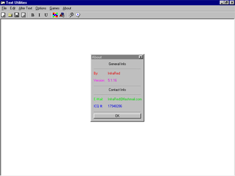



## Text Utilities \(Hot\!\)

### Description

Welcome to the new generation of text editing! TU (Text Utilities) is a full featured text editor (like word) that includes TONS of extra features!! Some of the features are: Font Bold/Italic/Underline/Color/Size/Name at selectable areas (like a real text editor), Alternating Caps (to give you a better idea of what these functions do, I will put in examples of what happens to the string 'Test' when put through them: tEsT), Backwards Text (tseT), Screwed Text (¯|¯ë_/¯-|-), Spaced Text (T e s t), Doubled Text (TTeesstt), Echoed Text (Test est st t), Scrambled Text (tTse), Twisted Text (eTts), Mixed Text (sTte), Encrypt (the MOST advanced encryption on planet source code, to have the encryption alone in a project, look for UE: h÷4y), Decrypt (h÷4y -> Test, duh), Basic Encryption/Decryption (¨&#353;³¸ or ¨&#353;³¸ -> Test), Basic Code (xTWGeuesUetS), Basic Decode (xTWGeuesUetS -> Test), Code 1 (one itself slow medium), Code 2 (AN NA AT AN), Decode 1 (one itself slow medium -> test, NOTE: Code 1 converts to lower case), Decode 2 (AN NA AT AN -> test, NOTE: Code 2 converts to lower case), Code Binary (01010100011001010111001101110100), Decode Binary (01010100011001010111001101110100 -> Test), tons of options, 3 games, saving/opening ability, encryption key saving/opening/printing ability, toolbar with runtime customization, and MUCH MUCH MORE!!! A must have for ANY programmer!!!! Compiled version also included in .zip file. Please visit my webpage at: http://hfubb.cjb.net/
 
### More Info
 

             |
---                |---
**Submitted On**   |2000-04-16 19:08:12
**By**             |[Infra](https://github.com/Planet-Source-Code/PSCIndex/blob/master/ByAuthor/infra.md)
**Level**          |Advanced
**User Rating**    |4.1 (41 globes from 10 users)
**Compatibility**  |VB 5\.0, VB 6\.0
**Category**       |[Encryption](https://github.com/Planet-Source-Code/PSCIndex/blob/master/ByCategory/encryption__1-48.md)
**World**          |[Visual Basic](https://github.com/Planet-Source-Code/PSCIndex/blob/master/ByWorld/visual-basic.md)
**Archive File**   |[CODE\_UPLOAD48714162000\.zip](https://github.com/Planet-Source-Code/infra-text-utilities-hot__1-6392/archive/master.zip)

